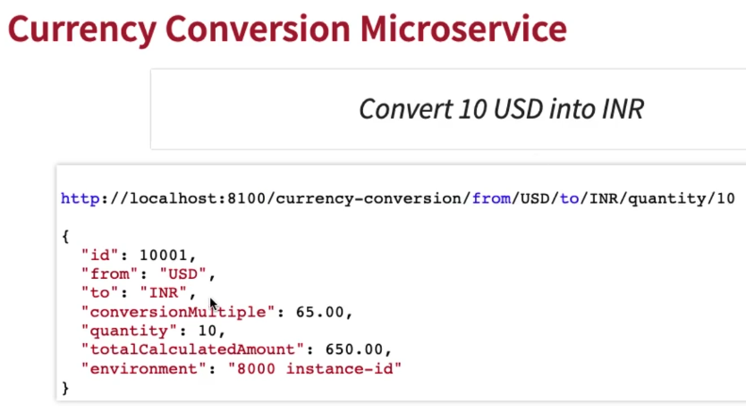

## Application structure Overview

We're building a complex disitrubted system => with (mutliple microservices, naming server, api gateway, distributed tracing, ...)

Overall structure of the project:


1. Microservice 1: Currency Exchange Microservice => what is the exchange rate of one currency to another

   - From this microservice we will be exposing a simple URL:

   

2. Microservice 2: Currency Conversion Microservice => convering 10 USD into INR

   - From this microservice we will be exposing a simple URL:

   

   - For the (Currency Conversion Microservice) to provide its featurs, it will call the (Currency Exchange Microservice)

   - It will ask what is the value of USD in INR today?

   - Then it would take the return value and multiply it with 10 (based on our request to convert 10 USD into INR).

## Load Balancing

- Later, we will have multiple instances of (CurrencyConversionMicroservice) and (CurrencyExchangeMicroservice)
- When calling from (CurrencyConversionMicroservice), I would need to know:
  - which instance of the (CurrencyExchangeMicroservice) is providing the response
  - is instance 1 of (CurrencyExchangeMicroservice) runnnig on port 8000 or 8001 or 8002
- That would help us identify whether our load balancers and naming servers are working properly

  

### Running multiple instances of microservice = is same as running the same SpringBoot app on different ports

This can be achieved by, going into editing Run/Debug Configurations in InteliJ.

1. You copy the application
2. Rename it, so:

   - first application => CurrencyExchangeServiceApplication 8000
   - second application => CurrencyExchangeServiceApplication 8001

     Configure this 2nd application to run on port 8001. Click Modify options -> Click Add VM options -> Paste -Dserver.port=8001

     Whatever you provide here as an environment variable, it would override whatever is configured in application.properties

We can return the port details to our client by @Autowired the Environment class provided by SpringBoot in any of our controllers:

```
import org.springframework.beans.factory.annotation.Autowired;
import org.springframework.core.env.Environment;
import org.springframework.web.bind.annotation.GetMapping;
import org.springframework.web.bind.annotation.PathVariable;
import org.springframework.web.bind.annotation.RequestMapping;
import org.springframework.web.bind.annotation.RestController;

import java.math.BigDecimal;

@RestController
@RequestMapping(path="currency-exchange")
public class CurrencyExchangeController {

    @Autowired
    private Environment environment;

    @GetMapping("from/{from}/to/{to}")
    public CurrencyExchange retrieveExchangeValue(@PathVariable String from, @PathVariable String to) {
        CurrencyExchange currencyExchange = new CurrencyExchange(1000L, from, to, BigDecimal.valueOf(50));
        String port = this.environment.getProperty("local.server.port");
        currencyExchange.setEnvironment(port);
        return currencyExchange;
    }
}
```
